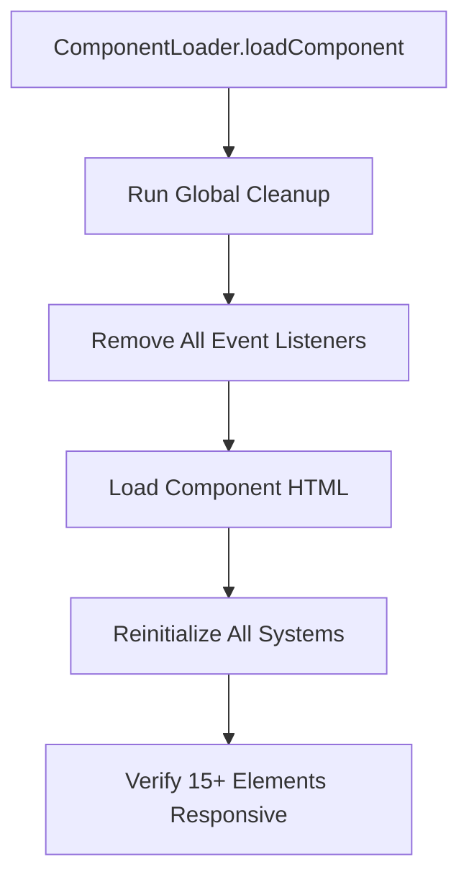

# Component Extraction Implementation Plan

## 🎯 Phase 1: ComponentLoader System Creation

### **System Overview**
The ComponentLoader will integrate with our bulletproof cleanup system to enable safe component extraction without breaking functionality.

### **ComponentLoader Architecture**



### **ComponentLoader Implementation Details**

**File**: `/AICodeReviewer.Web/wwwroot/js/core/component-loader.js`

**Core Functions**:
- `loadComponent(targetSelector, componentPath, options)`
- `unloadComponent(targetSelector)`
- `reinitializeAllSystems()`
- `validateComponentIntegrity()`

**Integration Points**:
- Pre-load: Run all cleanup functions
- Post-load: Reinitialize all event listeners
- Error handling: Rollback to previous state
- Performance: Cache loaded components

### **Cleanup System Integration**

```javascript
// Before component replacement
CodeGuard.cleanupAllSystems();

// After component load
CodeGuard.reinitializeAllSystems();
```

## 🎯 Phase 2: Header Component Extraction

### **Header Component Structure**

**File**: `/AICodeReviewer.Web/wwwroot/components/header.html`

**Content to Extract**:
```html
<header class="header">
    <div class="header-content">
        <div class="logo-section">
            <h1>AI Code Reviewer</h1>
            <p>Professional code analysis powered by AI</p>
        </div>
        <nav class="header-nav">
            <button class="btn btn-primary" id="load-documents-btn">Load Documents</button>
            <button class="btn btn-secondary" id="browse-repository-btn">Browse Repository</button>
            <button class="btn btn-secondary" id="validate-repository-btn">Validate Repository</button>
        </nav>
    </div>
</header>
```

### **index.html Modifications**

**Current Header** (to be replaced):
```html
<!-- Current static header -->
<header class="header">
    [existing content...]
</header>
```

**Dynamic Loading** (replacement):
```html
<!-- Dynamic header container -->
<div id="header-container" data-component="header"></div>
```

## 🎯 Phase 3: Validation Framework

### **Testing Protocol**

**Pre-Extraction Tests**:
- [ ] Verify all 15+ interactive elements work
- [ ] Document current button states
- [ ] Test complete workflow flow

**Post-Extraction Tests**:
- [ ] Confirm header loads dynamically
- [ ] Validate all buttons remain responsive
- [ ] Test workflow navigation still works
- [ ] Verify zero functional regressions

### **Interactive Elements Checklist**

**Workflow System**:
- [ ] Step indicators (1-4)
- [ ] Previous/Next navigation buttons
- [ ] Run analysis button
- [ ] Language selection dropdown
- [ ] Model selection dropdown

**Document System**:
- [ ] Load documents button
- [ ] Close document button
- [ ] Close error button

**Repository System**:
- [ ] Browse repository button
- [ ] Validate repository button
- [ ] Repository URL input
- [ ] Repository validation messages

**Repository Browser**:
- [ ] Repository navigation
- [ ] File selection
- [ ] Directory expansion/collapse

### **Error Handling & Rollback**

**Failure Detection**:
- Console error monitoring
- Element responsiveness testing
- Function call validation

**Rollback Strategy**:
- Immediate restoration of static header
- System state preservation
- Debug logging for troubleshooting

## 🎯 Implementation Sequence

### **Step 1: ComponentLoader Creation**
1. Create `component-loader.js` with cleanup integration
2. Add reinitialization hooks
3. Implement error handling

### **Step 2: Header Extraction**
1. Create `header.html` component file
2. Extract header content from `index.html`
3. Add dynamic loading container

### **Step 3: Integration Testing**
1. Test all 15+ interactive elements
2. Verify cleanup/reinit cycle
3. Confirm zero regressions

### **Step 4: Documentation**
1. Document extraction process
2. Create component development guidelines
3. Establish testing procedures

## 🎯 Success Criteria

- **Functionality**: All 15+ interactive elements remain responsive
- **Performance**: No degradation in load times
- **Maintainability**: Clean component structure
- **Scalability**: Framework ready for additional components
- **Reliability**: Zero functional regressions

## 🎯 Next Steps

1. **Create ComponentLoader system** (requires Code mode)
2. **Extract header component** (requires Code mode)
3. **Implement dynamic loading** (requires Code mode)
4. **Execute validation testing**

The plan is complete and ready for implementation with our bulletproof cleanup system as the foundation.